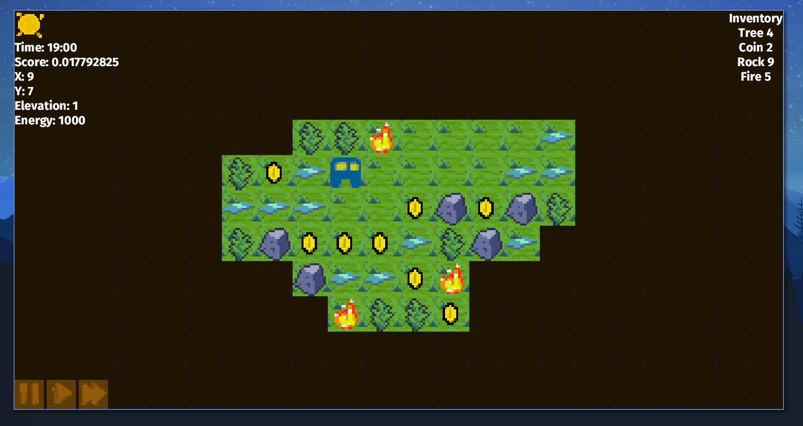
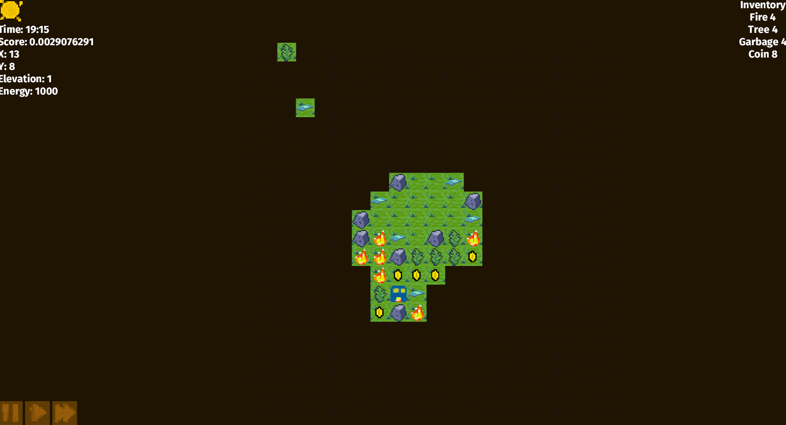
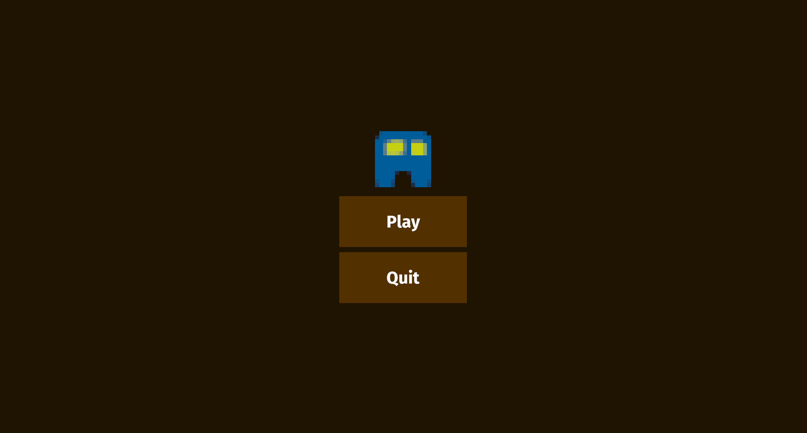

# RobotUI

My individual submission, made with [Bevy game engine](https://github.com/bevyengine/bevy) ❤️

# Keys

- 'w / up_arrow' move up 
- 's / down_arrow' move down 
- 'a / left_arrow' move left 
- 'd / right_arrow' move right 
- 'f' lock camera to player 
- 'p' pause game 
- 'o' unpause game
- 'z' double speed 
- 'x' normal speed 
- '-' zoom out camera 
- '+' zoom in camera
- 'esc' close game 

### Features

- [x] Slower tick
- [x] Player Movement
- [x] Rework for the map rendering
- [x] Camera follow player
- [x] Freecam
- [x] Add content over the tile
- [x] Change simulation speed
- [x] Graphics Overall
- [x] Vedere a distanza (discover_tiles)
- [x] UI
  - [x] Main Menu
  - [x] Inventory
  - [x] Height
  - [x] Score
  - [x] Environmental Conditions
  - [x] debug info (coordinates)
- [x] Audio 
